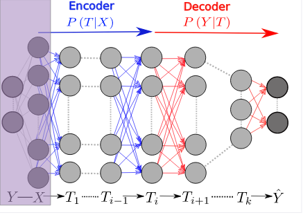

深度学习模型的黑箱特性是非常令人头疼的问题。目前的各种解释都是基于函数拟合或者统计模型，虽然看起来像是那么回事，但是距离一个清楚明了又通透的解释还有距离。最近希伯来大学的Tishby教授关于深度学习解释的一篇文章引起了大家的广泛兴趣，因为其所论证的Information BottleNeck模型提出了一种基于Markov Chain和信息论模型的解释，连Hinton都忍不住为该文章打起了广告。下面我们来对文章进行一下分析：

## 信息论基础

为了理解Information BottleNeck，一些基本的信息论知识必不可少。下面我们来对信息论中的各种不同的熵的定义进行一个简要的介绍。
首先，什么是熵？一言不合就得上公式，对于某个随机变量x，其熵的计算方法为：

$$H(x) = -\sum_{x\in X}p(x)logp(x)$$

此处的对数以2为底，主要是为了对应二进制的概念。为了保证该定义有意义，我们还需要提前约定//(0*log(0)=0//),其含义为概率为0的时间对熵没有任何影响。根据这个定义及约定我们可以看到，熵值恒为非负值。其最小值为0，当p(x)代表某个确定性时间，暨p(x)=1时成立。抛开数学定义，熵实际熵定义了该变量统计分布的无序性。越有序的事件（或者可预测的事件，如概率为1的事件）其熵值越小。而越小的熵值往往也代表了越大的信息量。此外，从另外一个角度来理解，熵值也是//(\frac{1}{p(x)})的期望。其定义并非数学上的孤立定义，与物理上常用的熵有联系。
在基本熵的基础上我们给出联合熵的定义：

$$H(x, y)=-\sum_{x\in X}\sum_{y\in Y}p(x, y)logp(x, y)$$

类似的，这个定义也可以理解成//(log(\frac{1}{p(x, y)})//)的期望。接下来主菜上桌，条件熵H(y|x)的定义为：

$$H(y|x) = \sum_{x\in X}H(Y|X=x)=-\sum_{x\in X}\sum_{y\in Y}p(x, y)logp(y|x)$$

这个熵的定义与之前的稍有不同，关键在于其遍历性的取了所有x的值对应的条件熵求和，其同样可以理解为p(y|x)的期望。取这种不同定义的原因马上就能揭晓，根据以上定义，我们可以得出链式法则：

$$H(X, Y) = H(X) + H(Y|X)$$

证明只需要通过一个概率分解及求和位置变换即可实现，此处从略。

当我们想要考量两个不同分布之间的相互关系时，就需要引入相对熵的概念了。它是两个随机分布之间距离的度量。例如，已知随机变量的真实分布为p，可以构造平均描述长度为H(p)的编码。但是如果使用针对分布q的编码，那么在平均意义上需要使用H(p)+D(p||q)比特来描述这个随机变量。相对熵（也叫做Kullback-Leibler距离）的定义如下：

$$D(p||q) = \sum_{x\in X}p(x)log\frac{p(x)}{q(x)}$$

类似的，为了保证定义处处有效，我们约定//(0*log\frac{0}{0}=0), plog\frac{p}{0}=\infty//)，可以证明，相对熵的值总是非负的，其值在p(x)=q(x)的情况下最小，为0。需要注意的一点是，相对熵不具有对称性，而且它并非是两个分布之间的真实距离。
最后我们再给出互信息的定义，它是一个随机变量包含另一个随机变量信息量的度量。互信息也是在给定另一个随机变量知识的条件下，原随机变量不确定度的缩减量。Tishby的论文中大量用到了该定义：

$$I(X;Y) = \sum_{x\in X}\sum_{y\in Y}p(x, y)log\frac{p(x,y)}{p(x)p(y)}=D(p(x,y)||p(x)p(y))$$

互信息其实是熵变化的一种表征，以下的公式说明了这一点：

$$I(X;Y) = H(X)-H(X|Y) = H(Y)-Y(Y|X)$$

从概念上来理解，该公式意思是给定了Y知识的条件下X的不确定度的缩减量。

有了以上的准备，就可以开始对文章的主要意义进行分析了。文章分析的过程还引用了两个关于mutual information的结论：
1.对于X和Y的可逆变换，其互信息不变，暨：

$$I(X;Y)=I(\sigma(X);\phi(Y))$$

2.对于任何三个变量如果存在Markov chain X->Y->Z, 则有：

$$I(X;Y)\ge I(X;Z)$$

暨最后链上较长的互信息较小。

结束了铺垫以后我们来讨论正题，这篇文章在考虑网络架构时非常有趣的将真实的Y值加入了网络架构之前，使得整个架构有一丝Autoencoder的意味。

根据这个网络架构及我们之前给出的关于Markov Chain的信息推论，我们可以得到如下的DPI(Data Processing Inequallity)

$$I(X;Y)\ge I(T_1;Y)\ge I(T_2;Y) \ge ... \ge I(T_k;Y)\ge I(\hat{Y};Y)$$

$$H(X)\ge I(X;T_1)\ge I(X;T_2)\ge ...\ge I(X;T_k)\ge I(X;\hat{Y})$$

